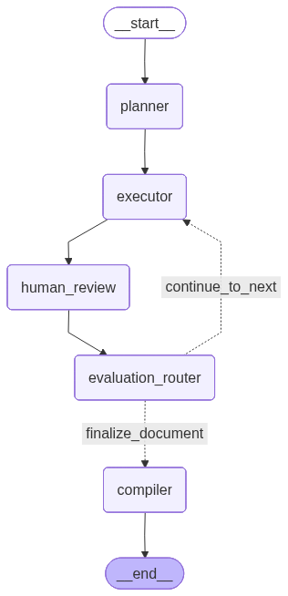

# 🤖 Multi-Step Document Generation Agent with Human-in-the-Loop Feedback

A single-endpoint FastAPI application powered by LangGraph and Ollama (`llama3.2`). The agent uses structured templates to break down a document request, executes content generation section by section, and pauses for human verification or modification after each step before compiling into a local `.docx` file.


## 🏗️ System Architecture & Workflow

The agent operates as a state machine with explicit checkpoint saving. Here is the step-by-step layout flow:



---

## 🧩 Graph Components Breakdown

### 1. State Definition (`CustomAgentState`)

Tracks all variables persistent across stateless API boundaries:

* **`request`**: The global user goal instruction.
* **`document_type`**: type of business document(ex:SOP,proposal, meeting minutes etc.)
* **`plan`**: Array of targeted structural headings.
* **`current_step_index`**: Numeric counter pointing to the active section.
* **`document_sections`**: Map accumulating completely approved content blocks.
* **`latest_draft`**: Staging area for unapproved section drafts currently under human review.
* **`feedback`**: Tracks active revision critique left by the user.
* **`file_path`**: path where docx file is stored
* **`logs`**: internal logs at each node

### 2. Graph Nodes

* **`planner_node`**: Classifies request keywords to match an industry standard layout template (SOP, Proposal, Minutes, Tech Design). Falls back to dynamic layout planning via LLM if no matching type is found.
* **`executor_node`**: Authors the section body content. If human critique is detected in the state, it switches to **Revision Mode**, passing the previous text block alongside the feedback to ensure precise editing.
* **`human_review_node`**: Halts the workflow execution thread using LangGraph's native `interrupt()` mechanic. It flushes state details out to the endpoint and waits for user intervention.
* **`evaluation_router_node`**: Interprets input. If approved, stores content into `document_sections` and advances the index counter. If rejected, preserves the feedback string to trigger an edit pass.
* **`compiler_node`**: Runs once all steps are passed. Iterates through the finalized memory tree and translates formatting into a Microsoft Word file (`.docx`).


---

## 🔌 API Interface Mechanics

The backend consolidates everything into a single endpoint: **`POST /agent`**

### Payload Signatures:

#### 🆕 Initiating a New Session:

Send a raw goal query without any thread constraints.

```json
{
  "request": "Write a proposal for a pet tracking mobile application"
}

```

* **Action**: Initializes the graph, sets a tracking `thread_id`, builds the layout blueprint, generates the draft for Step 1, and pauses.

#### 🔄 Iterating / Approving (Resuming Threads):

Provide the session identifier returned by the initialization step.

```json
{
  "thread_id": "YOUR_UUID_STRING_HERE",
  "feedback": "Make this section shorter and more concise."
}

```

* **Action**: Wakes up the graph context state using `Command(resume=...)`.
* **To Approve**: Pass an empty string (`"feedback": ""`) to commit the block and advance to the next step.
* **To Revise**: Pass textual critique instructions. The graph loops right back to step extraction without changing your header step index numbers.


## Files
1. **agent/index.py** - contains the agent graph creation code
2. **server.py** - FastAPI endpoint
3. **test_client.py** - Run this code to have interactive terminal with the agent endpoint

## How to test
1. have FluidAI as current directory
2. create a python venv - ```python3 -m venv venv```
3. activate the venv - ```source venv/bin/activate```
4. install requirements - ```pip install -r requirements.txt```
2. run this command to start FastAPI server - 
```uvicorn server:app --reload```
3. run this command to have an interactive terminal with the agent - ```python3 test_client.py```
